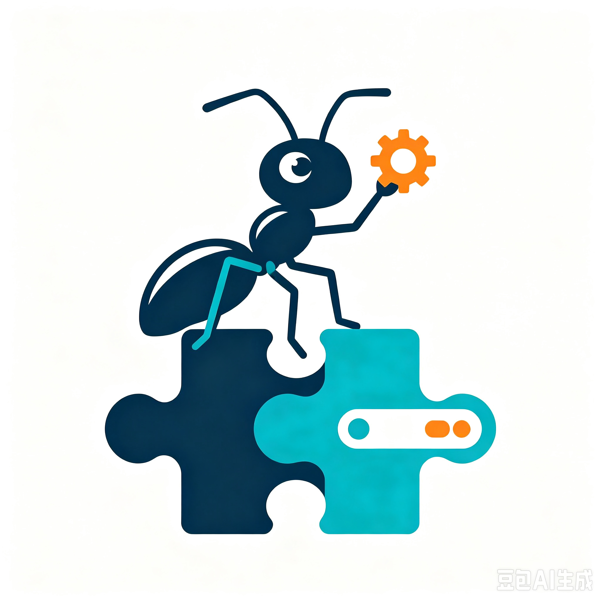

<div align="center">



# Ant-Captcha 🐜

**Ant-Captcha is a self-hosted CAPTCHA-solving service for robotic process automation (RPA).**

自用打码服务：媒体进，答案出。

[](LICENSE)

</div>

---

## 📖 简介

Ant-Captcha 是一套**自用的打码服务**：通过 HTTP API 接收验证码媒体（图片 / 音频 / 语义描述），返回结构化答案（文本 / 坐标 / 选择）。自托管、自控成本、可针对具体验证码定制，从小往大慢慢长。

**核心边界**：只做「媒体 → 答案」。不探索界面、不操作浏览器——取图、执行、校验全部由调用方负责，调用方与平台之间只隔一层 HTTP 协议，**语言无关、框架无关**。

> ⚠️ **声明**：本项目仅供学习研究与合法的 RPA 自动化场景使用，请遵守目标网站的条款与相关法律法规。

## ✨ 能力

- **多类型验证码**：数英 OCR / 中文字符 / 计算题 / 滑块缺口 / 点选（det + VLM）/ 语音（ASR）
- **定制类型**：针对具体验证码训练 ONNX 模型，注册后获得专属 type 代码（行业惯例，如「定制-xxx」）
- **多后端**：本地推理（ddddocr）+ 百炼外部 API（VLM / ASR），配置切换与降级链
- **协议友好**：HTTP 仅 POST，参数对齐行业惯例，现有打码用户可零成本迁移

## 📚 文档

| 文档 | 说明 |
|---|---|
| [需求文档](docs/requirements.md) | 完整需求 v0.6，含 API 协议规范与 type 代码表 |
| [架构设计](docs/architecture.md) | 分层架构、请求生命周期、设计决策（ADR） |
| [仓库布局](docs/repository-layout.md) | monorepo 结构与关键约定 |

## 🚀 快速开始（M0 骨架）

```bash
# 1. 配置密钥
cp docker/.env.example docker/.env   # 填写 ANTCAPTCHA_TOKEN

# 2. 一键起服务
docker compose -f docker/docker-compose.yml up --build

# 3. 调打码 API（M0 返回 10004 无此类型，M1 接入真实 Solver）
curl -X POST http://localhost:8080/api/solve \
  -H "Content-Type: application/json" \
  -d '{"token":"你的TOKEN","type":"1001"}'
```

**本地开发（不走 Docker）**：

```bash
# Node 平台服务
cd apps/api-server && pnpm install && pnpm test && pnpm dev

# Python 推理服务
cd services/model-server && uv sync && uv run pytest && uv run uvicorn app.main:app --port 8000
```

> 注：本机 Windows 沙箱下 vitest/tsx 不可用，测试统一用 Node 24 原生 `node --test`（`--test-isolation=none`）。

## 📁 目录结构

```
Ant-Captcha/
├── apps/api-server/       # 打码平台服务（Node.js + Cordis）
├── services/model-server/ # 自建推理服务（Python FastAPI + ddddocr）
├── contracts/             # OpenAPI 契约（两端唯一共识）
├── docker/                # docker compose 编排
├── docs/                  # 文档
├── examples/              # 参考集成（后置）
└── assets/                # Logo 等静态资源
```

## 🤝 贡献

欢迎通过 [Issue](https://github.com/Leonx01/Ant-Captcha/issues) 提交反馈，或提交 Pull Request 参与开发。

## 📄 许可证

[MIT](LICENSE) © Leonx01
